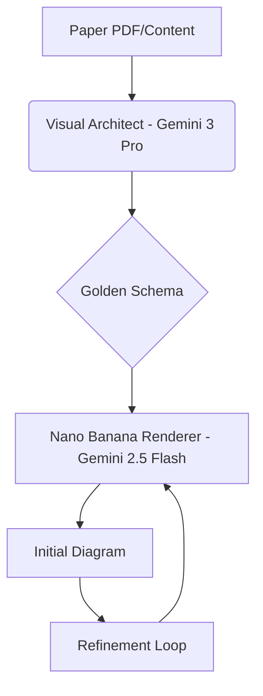

# 🏛️ PaperArch Architect

**PaperArch** is an advanced AI-powered workbench designed for researchers to transform complex methodology text into professional, publication-ready architecture diagrams. 

## 🚀 Features

- **Multi-Venue Optimization**: Specialized logic for ACL, EMNLP, KDD, ICML, NeurIPS, and CVPR aesthetics.
- **3-Phase Workflow**:
  1. **Logical Decoding**: Uses Gemini 3 Pro to extract structural semantics and select layout strategies (Pipeline, Cyclic, Hierarchical, etc.).
  2. **Neural Rendering**: Leverages Gemini 2.5 Flash (Nano Banana) to generate precise, vector-style schematic diagrams.
  3. **Natural Language Refinement**: Fine-tune specific visual elements using iterative prompting.
- **Scientific Visual Schema**: Implements a "Golden Schema" prompt system that forces the model to think in terms of spatial zones and physical connections rather than abstract concepts.

## 🛠️ Architecture

## 📦 Installation & Setup

1. **Prerequisites**: Ensure you have an API key with access to Gemini 3 and 2.5 series models.
2. **Environment**: The application expects `process.env.API_KEY` to be configured.

## 🎨 Design Philosophy

We prioritize **Technical Precision** over artistic flair. Every diagram follows a "Visio/Illustrator Aesthetic":
- Flat vector graphics.
- Clean 2D geometry.
- Soft pastel academic color palettes.
- High legibility for multi-column paper layouts.

---

Built with ❤️ for the research community.
